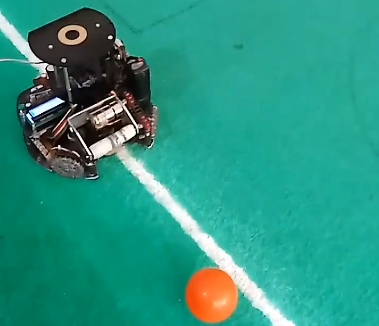

## IRA Open Weight Soccer robot codes and documents
This project is made to participate in Robocup Junior Soccer league.In this leage robots must play soccer with an orange ball. to se more description and rules see the [robocup website.](https://www.robocup.org/) This code includes algorythms and calculations to mesure the angle of the ball to the robot, the distance of the ball from the robot and other useful values. The algorythm must direct the robot behind the ball and catch it an then move it to the goal and get point.

### To use this code, copy and paste this command in a terminal
```
git clone https://github.com/fdmxfarhan/IRA-Open-Weight-Soccer.git
```
### IRA Open weight robot
 ........ 
